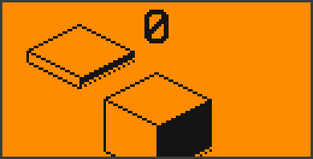
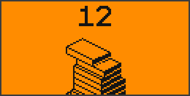
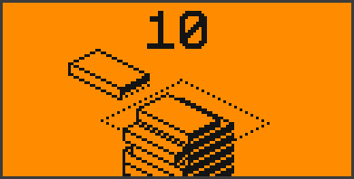
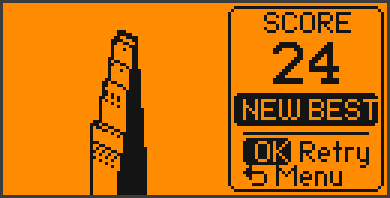
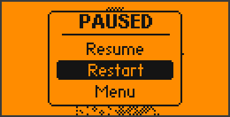
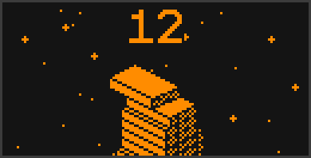
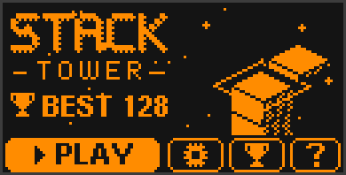
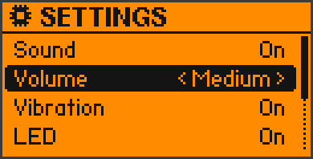
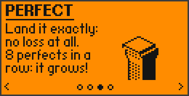

<div align="center">

# 🧱 Stack Tower for Flipper Zero

**The classic "Stack" arcade game — in real isometric 3D, on your Flipper.**
Drop the sliding slab at the right moment, slice off what hangs over,
land perfect drops and build the tallest tower you can.


[](https://github.com/King-Kong-341/Flipper-Zero-Games_Stack_Tower/actions/workflows/build.yml)

 

</div>

---

## What is this?

Stack Tower is a faithful remake of the hit mobile game **Stack** for the
Flipper Zero. A slab slides back and forth over your tower — press **OK** to
drop it. Whatever hangs over the edge is sliced off and tumbles down, so
your tower gets narrower with every miss. Land a slab **exactly** on the one
below and you lose nothing at all; chain eight of those perfect drops and
the slab even grows back. Miss the tower completely and it's game over —
the camera zooms out and shows off the whole tower you built.

Everything is drawn in isometric 3D by a small software renderer written
for the Flipper's 128 × 64 black-and-white screen, running smoothly at
40 fps. One button, simple rules, very hard to put down.

## ✨ Features

| | |
|---|---|
| 🧱 **Original rules** | Slabs slide in alternately along both axes, overhangs are sliced off, perfect drops keep the size, 8 perfects in a row make the slab grow, 1 point per slab, slowly getting faster |
| 🎲 **Isometric 3D** | Real 3D tower with lit top, light and dark sides, falling cut-off pieces, a camera that rises with the tower and zooms out to show the whole thing at game over |
| ✨ **Perfect effects** | Expanding ring on every perfect drop, rising musical notes (pentatonic scale) with every perfect in a row, a special chime when the slab grows |
| 🎬 **Intro animation** | Slabs fall onto the pillar, the logo drops in letter by letter, the menu slides up (skippable, can be turned off) |
| 🤖 **Live title screen** | An autopilot keeps stacking a tower in the background — and lets it crumble when it gets too high |
| 🌗 **3 backgrounds** | **Day** (clean), **Dots** (parallax dot grid that scrolls as you climb) and **Night** (dark mode with twinkling stars) |
| ⏸ **Pause menu** | Resume, restart or go back to the menu at any time |
| 📈 **Stats** | Best score, games played, slabs stacked, perfect drops, best perfect streak, average score, perfect rate |
| ❓ **How to play** | 3 help pages with small animated demos |
| 🔊 **Sound · vibration · LED** | Different sounds for every event, short haptic taps, LED colours (blue = perfect, cyan = grow, red = game over, green = new best). Each switchable, 3 volume levels |
| 💾 **Saved automatically** | Settings and stats live on the SD card |

## 📥 Installation

### Option A — Ready-made app (easiest)

1. Download **[`stack_tower.fap`](stack_tower.fap)** (also attached to every
   [release](https://github.com/King-Kong-341/Flipper-Zero-Games_Stack_Tower/releases)).
2. Open [qFlipper](https://flipperzero.one/update) and connect your Flipper via USB.
3. In the **File Manager**, copy the file to `SD Card/apps/Games/`.
4. On the Flipper: **Menu → Apps → Games → Stack Tower**.

> Built for the **official firmware 1.x** (SDK 1.4.3). If your firmware is
> much newer or older and the app refuses to start, build it yourself (Option B).

### Option B — Build from source

You need [Python 3](https://www.python.org/downloads/) and
[`ufbt`](https://github.com/flipperdevices/flipperzero-ufbt):

```bash
pip install ufbt
python -m ufbt            # builds dist/stack_tower.fap
python -m ufbt launch     # builds, installs and starts it on a connected Flipper
```

Or use the helper scripts in [`scripts/`](scripts/) (`build.ps1` / `build.sh`,
`install.ps1` / `install.sh`). Close qFlipper first — it blocks the USB port.

## 🎮 How to play

| Key | In the game | In menus |
|---|---|---|
| **OK** | drop the slab | select |
| ◀ ▶ ▲ ▼ | drop the slab too (like tapping anywhere) | move / change a value |
| **Back** | pause menu | one screen back · on the title screen: exit |

1. The slab slides over the tower — press **OK** when it lines up.
2. The part hanging over the edge is **sliced off**. Your next slab is only
   as big as what's left.
3. Land it **exactly** (a small tolerance is allowed) for a **perfect**: a ring
   flashes, a note plays and nothing is lost. Every perfect in a row plays a
   higher note.
4. From the **8th perfect in a row** on, every perfect makes the slab
   **grow** back a little, up to its original size.
5. Miss the tower completely and it's **game over**. Each slab is 1 point.

📖 **Everything in detail: [User Guide](docs/USER_GUIDE.md)**

## 🖼 Screens

| | | |
|:-:|:-:|:-:|
|  |  |  |
| Title screen | Stacking | Perfect drop |
|  |  |  |
| Overhang sliced off | Game over — new best | Pause |
|  |  |  |
| Night background | Dots background | Title at night |
|  |  |  |
| Settings | Stats | How to play |

<sub>Screens and GIFs are rendered on a PC with the Flipper's real fonts using
the preview tool in [`tools/flipper_preview`](tools/flipper_preview/) — they are
pixel-accurate, but the orange is just for looks.</sub>

## 🗂 Project structure

```
Flipper-Zero-Games_Stack_Tower/
├── application.fam          # app manifest (name, icon, category, entry point)
├── stack.h                  # shared types, constants (game tuning!), declarations
├── stack_main.c             # start-up, main loop (40 fps), input routing
├── stack_game.c             # rules, slicing, perfects, falling pieces, camera, autopilot
├── stack_render.c           # 1-bit framebuffer, isometric 3D renderer, backgrounds, logo
├── stack_screens.c          # intro, title, game HUD, pause, game over, settings, stats, help
├── stack_fx.c               # sound, vibration and LED sequencers
├── stack_store.c            # settings + stats on the SD card
├── icon.png / make_icon.py  # 10x10 app icon and the script that draws it
├── stack_tower.fap          # ready-to-install build
├── scripts/                 # build / install / preview helpers
├── tools/flipper_preview/   # PC preview of all screens with the real Flipper fonts
└── docs/                    # user guide, developer guide, screenshots
```

Want to make it easier or harder, or understand how the 3D renderer works?
➡️ **[Developer Guide](docs/DEVELOPMENT.md)**

## 🛠 Built with

- [ufbt](https://github.com/flipperdevices/flipperzero-ufbt) — micro Flipper Build Tool
- The official [Flipper Zero firmware](https://github.com/flipperdevices/flipperzero-firmware) SDK

Inspired by *Stack* by Ketchapp. This is an independent fan remake and not
affiliated with Ketchapp.

## 📄 License

MIT — see [LICENSE](LICENSE).
