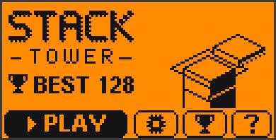
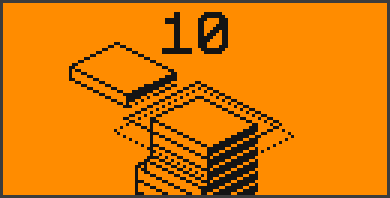
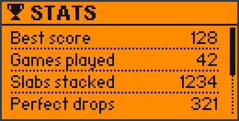

<div align="center">

# 🧱 Stack Tower for Flipper Zero

**The classic "Stack" arcade game — in real isometric 3D, on your Flipper.**
Drop the sliding slab at the right moment, slice off what hangs over,
land perfect drops and build the tallest tower you can.


[](https://github.com/King-Kong-341/Flipper-Zero-Games_Stack_Tower/actions/workflows/build.yml)

 

</div>

---

## 📁 What's in here?

| Folder | What it is | Who needs it |
|---|---|---|
| 📦 **[`Stack Tower/`](Stack%20Tower/)** | the finished game: **`stack_tower.fap`** | everyone — this is the file for your Flipper |
| 🧩 [`source/`](source/) | the C source code | only if you want to build or change the game |
| 🖼 [`images/`](images/) | the pictures on this page | — |

## 🎯 What is this?

A faithful remake of the hit mobile game **Stack**. A slab slides back and
forth over your tower — press **OK** to drop it. Whatever hangs over the
edge is sliced off, so your tower gets narrower with every miss. Land a
slab **exactly** on the one below and you lose nothing. Miss the tower
completely and it's game over — the camera zooms out and shows the whole
tower you built. One button, simple rules, very hard to put down.

## 📥 Installation

1. Open the folder **[`Stack Tower`](Stack%20Tower/)** and click
   **`stack_tower.fap`** → **Download** (the ⬇ button on the right).
   It's also on the [Releases page](https://github.com/King-Kong-341/Flipper-Zero-Games_Stack_Tower/releases).
2. Open [qFlipper](https://flipperzero.one/update) on your computer and
   connect your Flipper via USB.
3. In qFlipper's **File Manager**, copy the file to **`SD Card/apps/Games/`**.
4. On the Flipper: **Menu → Apps → Games → Stack Tower**. Have fun!

> Made for the **official Flipper firmware 1.x**. If the app doesn't start
> on your firmware, build it yourself (see the end of this page).

## 🎮 How to play

| Key | In the game | In menus |
|---|---|---|
| **OK** | drop the slab | select |
| ◀ ▶ ▲ ▼ | drop the slab too | move / change a value |
| **Back** | pause menu | go back · on the title screen: exit |

- **Slice:** the part hanging over the edge is cut off — the next slab is
  only as big as what's left.
- **Perfect:** land it exactly and nothing is lost. A ring flashes and a note
  plays — every perfect in a row plays a higher note.
- **Grow back:** from the **8th perfect in a row** on, the slab grows back a
  little with every perfect.
- **Game over:** miss the tower completely. Every slab is 1 point, and the
  slabs slowly get faster.

## ✨ Features

- 🎲 **Isometric 3D** at 40 fps — falling pieces, a camera that rises with the
  tower and a zoom-out over the whole tower at game over
- 🎬 **Intro animation** and a live title screen where an autopilot stacks
  (and crumbles) a tower
- 🌗 **3 backgrounds:** Day, Dots (moves as you climb) and Night (dark mode
  with twinkling stars)
- 🔊 **Sound, vibration & LED** for every event — blue for a perfect, cyan
  when the slab grows, red for game over, green for a new best
- ⚙️ **Settings:** sound, volume, vibration, LED, background, intro
- 📈 **Stats:** best score, games, slabs, perfects, best streak, average,
  perfect rate — saved on the SD card
- ⏸ **Pause menu** and **how-to-play pages** with little animated demos

## 🖼 Screens

| | | |
|:-:|:-:|:-:|
|  |  |  |
| Title screen | Perfect drop | Overhang sliced off |
|  |  |  |
| Game over — new best | Pause | Night background |
|  |  | |
| Settings | Stats | |

## 🛠 Build it yourself

Only needed if the ready-made file doesn't work on your firmware or you want
to change something. You need [Python 3](https://www.python.org/downloads/):

```bash
pip install ufbt
cd source
python -m ufbt            # -> source/dist/stack_tower.fap
python -m ufbt launch     # or: build, install and start it on a connected Flipper
```

Game tuning (speed, perfect tolerance, grow streak) is at the top of
[`source/stack.h`](source/stack.h).

---

Inspired by *Stack* by Ketchapp — an independent fan remake, not affiliated
with Ketchapp. MIT licensed, see [LICENSE](LICENSE).
