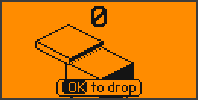
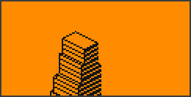
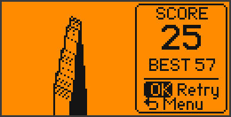
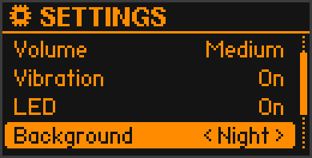
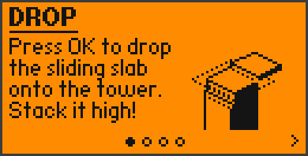
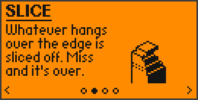

# 📖 Stack Tower — User Guide

Everything the app can do, screen by screen.

- [Starting the app](#-starting-the-app)
- [The title screen](#-the-title-screen)
- [Playing](#-playing)
- [Perfect drops & growing back](#-perfect-drops--growing-back)
- [Game over](#-game-over)
- [Pause](#-pause)
- [Settings](#-settings)
- [Stats](#-stats)
- [How to play pages](#-how-to-play-pages)
- [Sound, vibration & LED](#-sound-vibration--led)
- [Tips for high scores](#-tips-for-high-scores)
- [FAQ](#-faq)

---

## 🚀 Starting the app

**Menu → Apps → Games → Stack Tower.**

The app starts with a short intro: the pillar rises, four slabs drop onto
it, the logo falls in letter by letter and the menu slides up. **Any key
skips it**, and you can switch it off completely in **Settings → Intro
animation**. The screen stays on while the app is open.

## 🏠 The title screen

 

On the right an autopilot keeps building a tower — watch it crumble when it
gets too high. On the left you see your **best score**.

The bar at the bottom is the menu. Move with **◀ ▶**, open with **OK**:

| Button | Opens |
|---|---|
| **▶ PLAY** | a new game (selected by default — just press OK) |
| ⚙ | Settings |
| 🏆 | Stats |
| ? | How to play |

**Back** on the title screen closes the app.

## 🎮 Playing

  

- A slab slides back and forth over the tower. Press **OK** to drop it.
  All arrow keys drop it as well — like tapping anywhere on a phone.
- The slab is dropped **the moment you press** the key, not when you let go.
- Whatever hangs over the edge of the slab below is **sliced off** and falls
  down. The rest stays on the tower, and the next slab has exactly that size.
- Slabs alternate between the two directions: one comes from the upper
  left, the next from the upper right.
- Every slab you place is **1 point** (the big number at the top).
- The slabs get **slowly faster** the higher you go.
- The camera rises with the tower, so the top is always in view.

For your first games a small **"OK to drop"** hint shows at the bottom.

## ✨ Perfect drops & growing back

Land a slab exactly on top of the one below (a small tolerance is allowed)
and it's a **perfect drop**:

- nothing is sliced off,
- a ring expands around the slab,
- a note plays — and every perfect **in a row** plays a higher note,
- the LED flashes blue and the Flipper gives a short buzz.

From the **8th perfect in a row** on, every further perfect makes the slab
**grow** back a little (up to its original size) — with a special chime and
a cyan LED. A normal (non-perfect) drop resets the streak.

## 💥 Game over

  

If a slab misses the tower completely, it falls — and the game is over. The
camera zooms out until the **whole tower** fits on the screen, then the
result panel slides in:

- **SCORE** — slabs placed in this game
- **NEW BEST** (blinking, with a jingle and green LED) or your current **BEST**
- **OK** — play again right away
- **Back** — back to the title screen

Press **OK** during the zoom to skip it.

## ⏸ Pause

Press **Back** while playing. **▲ ▼** to choose, **OK** to confirm:

| Option | Does |
|---|---|
| Resume | continue (Back works too) |
| Restart | start a new game (the paused one is not counted) |
| Menu | back to the title screen (not counted) |

## ⚙️ Settings

 

**▲ ▼** choose a row, **◀ ▶** (or OK) change it, **Back** saves and goes back.

| Setting | Values | |
|---|---|---|
| Sound | On / Off | all sounds |
| Volume | Low / Medium / High | plays a test tone when changed |
| Vibration | On / Off | buzzes once when switched on |
| LED | On / Off | flashes once when switched on |
| Background | Day / Dots / Night | see below |
| Intro animation | On / Off | the intro at app start |
| Reset stats | OK → confirm | clears best score and all totals (settings stay) |

### Backgrounds

  

| | |
|---|---|
| **Day** | clean light background — the clearest view |
| **Dots** | a dot grid that scrolls down as your tower rises (parallax) |
| **Night** | dark mode: black sky with twinkling stars that drift by as you climb. All menus switch to dark too |

## 📈 Stats

Scroll with **▲ ▼**, **Back** to leave.

| Stat | Meaning |
|---|---|
| Best score | your highest score |
| Games played | finished games (paused-and-quit games don't count) |
| Slabs stacked | all slabs placed in all games |
| Perfect drops | all perfect drops |
| Best perfect streak | most perfects in a row in one game |
| Average score | slabs stacked ÷ games played |
| Perfect rate | how many of your drops were perfect |

## ❓ How to play pages

  

Three short pages, each with a little animated demo, plus an **About** page.
**◀ ▶** to flip pages, **Back** to leave.

## 🔊 Sound, vibration & LED

| Event | Sound | Vibration | LED |
|---|---|---|---|
| Slab placed | short "tock" | tiny tap | dim white blink |
| Perfect drop | note, one step higher per perfect in a row | short buzz | blue, brighter with the streak |
| Slab grows | quick rising chime | double buzz | cyan |
| Game over | falling tones | long buzz | red |
| New best | fanfare | three buzzes | green ×3 |
| Menus | soft clicks | — | — |

Each of the three can be switched off in the settings.

## 🏆 Tips for high scores

- **Watch the edge, not the middle.** Line up the front corner of the moving
  slab with the corner of the tower.
- **Perfects are worth more than they look.** They keep your slab big —
  and a big slab is what keeps you alive later.
- **Don't rush.** The slab comes back — waiting one more pass is better
  than a sloppy drop.
- **Chase the streak.** Eight perfects in a row start growing your slab back.

## ❔ FAQ

**The app doesn't start / "API mismatch".**
Your firmware is much newer or older than the SDK the `.fap` was built with.
Build it yourself for your firmware — see [Option B in the README](../README.md#option-b--build-from-source).

**There's no sound.**
Check **Settings → Sound** and **Volume**. If another app was using the
speaker, sound comes back within a couple of seconds.

**Where are my stats saved?**
`SD Card/apps_data/stack_tower/stack.sav`. Delete that file to reset
everything including the settings.

**Does it work on custom firmware (Unleashed, Momentum, …)?**
Usually yes, as long as the API version matches — otherwise build it
from source against your firmware's SDK.
